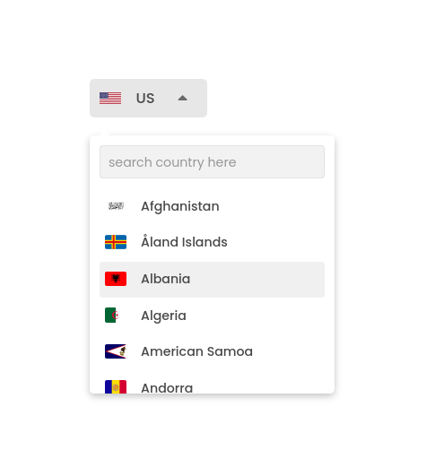

# react-country-dropdown

A simple react country selection dropdown component.

> No external dependencies, just a clean functional component.

[](https://npmjs.com/package/react-country-dropdown) [](https://npmjs.com/package/react-country-dropdown)



## Install

```sh
npm i react-country-dropdown
```

## Usage

Check the full documentation and demo [here](https://rocktimsaikia.github.io/react-country-dropdown/).

```jsx
import ReactCountryDropdown from "react-country-dropdown";

const Example = () => {
	return (
		<ReactCountryDropdown
			defaultCountry="JP"
			onSelect={(country) => console.log(country.name)}
		/>
	);
};
```

## API

The `<ReactCountryDropdown/>` component accepts only two props.

### Props:

| Name             | Type   | Required | Default | Description                                                               |
| ---------------- | ------ | -------- | ------- | ------------------------------------------------------------------------- |
| `defaultCountry` | string | Yes      | `null`  | The default country code to be selected.                                  |
| `onSelect`       | func   | Yes      | `null`  | Callback function when a country is selected. Returns the country object. |

#### Country Object:

```json
{
	"name": "Japan",
	"code": "JP",
	"code2": "JPN",
	"capital": "Tokyo",
	"region": "Asia",
	"citizen": "Japanese",
	"flagUrl": "https://flagcdn.com/jp.svg",
	"callingCodes": ["81"],
	"timezones": ["UTC+09:00"],
	"latlng": [36, 138],
	"currencies": [{ "code": "JPY", "name": "Japanese yen", "symbol": "¥" }]
}
```

## License

[MIT](./LICENSE) &copy; 2024 [Rocktim Saikia](https://github.com/rocktimsaikia)
